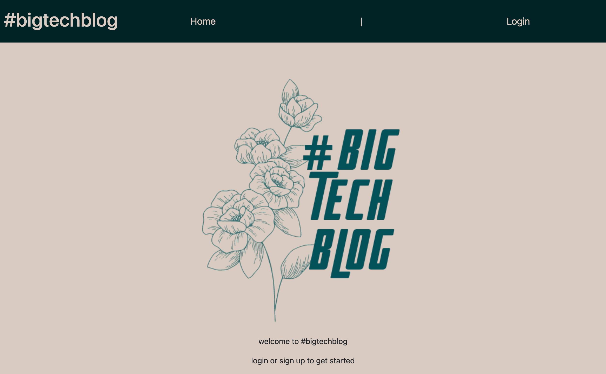

# tech-blog

## #bigtechblog by Charlotte Clark

## Usage

When you open the site, you will see the #bigtechblog logo,
and you can click the login button in the nav bar to login or sign up. 
Once you are signed in you will see navigation links for the the dashboard and the option to log out. 
On the dashboard, you will see a list of existing blog posts, with the title and date created.
If you are interested in any of the blogs, click on the title, and you will see the full post,
with the username, post content, date of positing, and the ability to add a comment.
You can add new posts on the dashboard. 

## Languages

* Javascript
* HTML
* CSS
* Handlebars.js
* Node.js
* Express.js
* Heroku
* Mysql2

[Heroku URL](https://radiant-ocean-47580.herokuapp.com/)

## Questions
Please contact charlotte.clark@alumni.usc.edu with any questions.

## Licensing
Copyright 2021 Charlotte Clark

Permission is hereby granted, free of charge, to any person obtaining a copy of this software and associated documentation files (the "Software"), to deal in the Software without restriction, including without limitation the rights to use, copy, modify, merge, publish, distribute, sublicense, and/or sell copies of the Software, and to permit persons to whom the Software is furnished to do so, subject to the following conditions:

The above copyright notice and this permission notice shall be included in all copies or substantial portions of the Software.

THE SOFTWARE IS PROVIDED "AS IS", WITHOUT WARRANTY OF ANY KIND, EXPRESS OR IMPLIED, INCLUDING BUT NOT LIMITED TO THE WARRANTIES OF MERCHANTABILITY, FITNESS FOR A PARTICULAR PURPOSE AND NONINFRINGEMENT. IN NO EVENT SHALL THE AUTHORS OR COPYRIGHT HOLDERS BE LIABLE FOR ANY CLAIM, DAMAGES OR OTHER LIABILITY, WHETHER IN AN ACTION OF CONTRACT, TORT OR OTHERWISE, ARISING FROM, OUT OF OR IN CONNECTION WITH THE SOFTWARE OR THE USE OR OTHER DEALINGS IN THE SOFTWARE.
